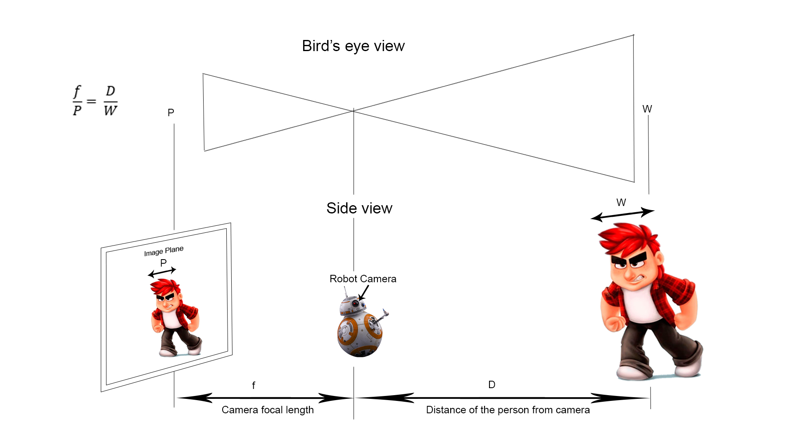
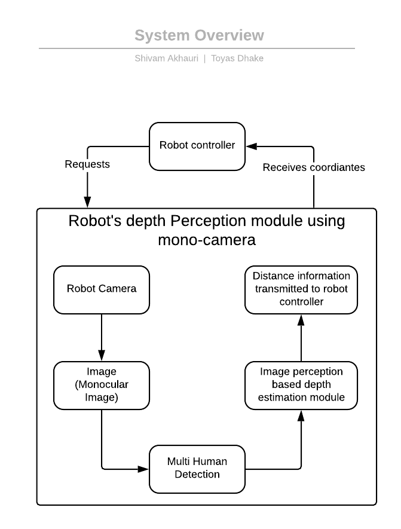
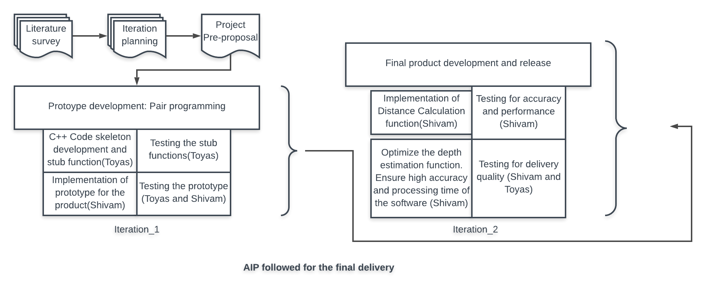

[](https://travis-ci.org/shivamakhauri04/midterm_project)       [](https://coveralls.io/github/shivamakhauri04/midterm_project?branch=master)      [](https://github.com/shivamakhauri04/midterm_project/blob/master/LICENSE.txt)

# Depth perception module for Acme Robotics

## Overview

The depth perception module aims to combine computer vision concepts with image 
processing techniques to estimate the distance of the human from the camera. 
We use the Histogram of Gradients (HOG) feature extractor as a human face 
feature detector and apply pioneering image processing techniques based on 
pin hole camera concept to provide accurate depth results.

We use the HOG (Histograms of Gradients) algorithm for human face detection. 
We use open source DLib for face detection. DLib inherently implements HOG with 
the best optimized hyperparameters for faster processing speeds on a CPU 
(benchmarks results show best - ‘processing speed’ vs accuracy ratio for dlib, 
even better than the SSD object detection by Google which is currently 
benchmarked as the best ‘processing speed’ detection algorithm and widely used). 
Dlib also have the best accuracy in terms of side view face detection. 
Dlib is Open Source (license) and widely used across industries.

We use OpenCV (v3.0) for supporting our computer vision and image processing 
tasks. OpenCV allows faster implementations and rapid prototyping and is open 
source (license).

We propose image processing techniques to estimate the distance of the human 
from the camera. We extrapolate the pin hole camera concept and apply it to 
real world scenarios. As explained in the diagram below, the distance of the 
human from the camera is a function of the camera focus and pixel width of the 
human face. The camera focus is calculated using a reference image with the 
human at a known depth from the camera.



### Main features of the product

- Distance perception for 'multiple humans' concurrently from the 
Robots frame of reference
- Fast processing speed
- Cost effective solution - needs installation of only a camera in the Robot
- High accuracy
- Developed in C++(>11) with continuous integration 
- Developed by a team of two in an Agile iterative process 
- Standalone software product which includes all the dependencies. 

### Results 


As illustrated in the demonstration result above, our product gives Humans 
location from the camera frame accurately along the X,Y and Z axis, where the 
X and Y coordinates specify the Humans position in the 2 Dimension and the 
Z axis specifies the human position in terms of the depth(distance from the 
camera) in the 3rd Dimension.

***Result format = (x_coordinate <in pixels>, y_coordinates <in pixels>, z coordinates <in meters>)***
The above result is appended on the lower right corner of the human face-bounding rectangle. 

***Accuracy***: 100% (tested on 3 test images and got correct distances of the 
human faces for all the three test cases. Deviations of +-10 centimeters observed 
and ignored. Also did testing on may live feeds).
 
***Processing speed***: average 38 milliseconds (tested on images on I5 CPU with
8GB RAM). The results may vary with different system configurations and with increase 
in the number of faces in the frame.

### Known Limitations and Assumptions for the product :
1. The depth estimation of the human from the robot’s frame of reference works 
within a range of 0.25 meters to 5 meters (in ambient lighting conditions).
2. The depth estimation model expects satisfactory lighting conditions.
3. The depth estimation model expects the human face to be facing the robot 
camera and within its field of view. 
4. The depth estimation model presented here is tuned for Acme Robot camera 
specifications. Hyperparameters need to be re-calibrated before being deployed 
to another class of robots.
5. We assume that the average width of adult human face does not vary much. 
Calculation differences due to minor width differences (delta) are mitigated by 
P (pixel width values) which also increases proportionally with delta.


### System Overview


The above shows the high level diagram of our system and the way it integrates 
with the other components of the robotic system.

### Agile Development Process followed


We followed the Pair Programming development procedure which started with 
both the developers doing an extensive literature survey. After agreement on 
the algorithm and the approach, we moved ahead with the first level iteration 
planning. The week one of the project involved development of stub functions and
basic test cases, which was driver driven while the navigator was involved in 
planning and sanity check as well as a prototype development for the complete 
product as a proof of concept.
The week 2 was started with the review of the potential risks and the remaining
backlogs. We switched the roles, and the current driver implemented the 
optimized distance calculation function and the accuracy/performance test cases,
while the navigator did the review and to ensure quality of the product delivery.

### AIP Details link
https://docs.google.com/spreadsheets/d/1t8c64cWS98ADABuzGFxU81cme3-aIhM_4wCTikXWeNU/edit?usp=sharing

### Meeting Notes (Minutes of Meetings)
https://docs.google.com/document/d/1sAKEHlb5n9JzfRYK6OL4Pm4foj7QHOMjy63lytvxo4Y/edit?usp=sharing

### Demo to run GMock test
```
For running our solution:

git clone https://github.com/shivamakhauri04/midterm_project.git
cd midterm_project
git checkout GMock_Extra_Credit
mkdir build
cd build
cmake ..
make -j<number of cores>  (Example- make -j12)
Run tests: ./test/cpp-test
```
Note: The cmake command may prompt the user to enter his/her system's password
to check for pre-requisite sytem libraries, like X11, CBLAS, LAPACK. 

### Known Issues and bugs
- The open- source library used- Opencv and dlib have not been completely 
written in C++ 11 and greater. Hence cmake generates warnings.

- For performance measurement in terms of processing speed, we use chrono which
doesn't comply with cpplint.


### Copyright

Copyright (C) 2019 Shivam Akhauri, Toyas Dhake.

For license information, see [LICENSE.txt](LICENSE.txt).


### Contributors

-Shivam Akhauri (Driver)
-Former Artificial Intelligence Engineer at Ether Labs.
-Former Machine learning Engineer and Project Lead at Tata Elxsi.
-Skilled in AI/ML with applications in Computer vision, NLP and Robotics.

-Toyas Dhake (Navigator)
-Robotics engineer, University of Maryland College Park.
-Skilled in embedded system with applications involving Arduino, Raspberry Pi 
and Jetson Boards.


